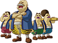

# Categorizing Sequences

<div class="grid cards" markdown>

-    <b>&nbsp;&nbsp;THIS PAGE IS A WIP</b>
  
    ---

    This page is a work in progress and requires further editing.

</div>

This page details how to categorize custom music for the *Ocarina of Time* and *Majora's Mask* randomizers, as well as the *Ocarina of Time & Majora's Mask* combo randomizer, so that sequences will play in appropriate areas in-game.

### Making a META File for Ocarina of Time
To make a META file for an `.ootrs` file, create a text file with the extension `.meta` that has the same filename as the sequence this data is for (e.g. `mkwii-moonview.seq` will have a META file with the name `mkwii-moonview.meta`).

The META file's structure is presented below:

=== "Template"

    **Vanilla Audiobank:**

    ```
    songname
    0x00
    bgm/fanfare
    musicgroups
    ```

    **Custom Audiobank:**

    <div class="annotate" markdown>
    
    ```
    songname
    - (2)
    bgm/fanfare
    musicgroups
    ZSOUND:filename.zsound:######## (1)
    ```

    </div>

    1. If using a sampled instrument, drum, or sound effect, this line, and subsequent lines for however many samples are used, must be included, otherwise omit this line and subsequent lines.
    2. If using a custom audiobank, use a hyphen `-` instead of the number of the audiobank the sequence uses.

=== "Example"

    **Vanilla Audiobank:**

    ```
    Mario Kart Wii - Moonview Highway
    0x03
    bgm
    Fields,Town,Dungeon
    ```

    **Custom Audiobank:**

    <div class="annotate" markdown>

    ```
    Mario Kart Wii - Moonview Highway
    - (2)
    bgm
    Fields,Town,Dungeon
    ZSOUND:EORG253.zsound:41B3ABEC (1)
    ZSOUND:EORG268.zsound:41B3ABED
    ZSOUND:EORG286.zsound:41B3ABEE
    ZSOUND:O-HIT80.zsound:43AC22DB
    ZSOUND:SAW0-48.zsound:446535FF
    ZSOUND:SAW0-60.zsound:44653600
    ZSOUND:SAW0-72.zsound:44653601
    ```

    </div>

    1. If using a sampled instrument, drum, or sound effect, this line, and subsequent lines for however many samples are used, must be included, otherwise omit this line and subsequent lines.
    2. If using a custom audiobank, use a hyphen `-` instead of the number of the audiobank the sequence uses.

The first line of the META file is the name of the sequence. This name must be unique as no two sequences can share the exact same name. Generally, `Game Name - Song Name` will work unless a sequence with that name already exists and the user uses both sequences.

??? tip "Recommendation"
    It is recommended not to use quotation marks in a sequence name as it will make it harder for people creating a cosmetic plandomizer file.

The second line of the META file is the audiobank the sequence uses. For example, if using audiobank `0x03`, then the second line will be `0x03`. However, if using a custom audiobank, then a `-` must be used instead.

The fourth line of the META file is the locations the sequence will appear in, known as "music groups". This will be explained in greater detail below.

The fifth and subsequent lines of the META file is for extra data, such as `.zsound` files. These lines are for when a sampled instrument, drum, or sound effect is being used. If a sampled instruments, drums, or sound effects is not being used, the META file ends at the fourth line.

#### Music Groups
Music groups determine where a sequence will play in-game. This information is specified in the META file. A META file can include a set of named music groups with varying specificity. These named music groups should be in a comma-separated list. They are listed below, with an online music groups tool available [here](https://thesounddefense.github.io/musicgroups/ "Darunia's Joy Music Groups Tool
"){ target="__blank" }<small>:material-open-in-new: </small>, to help determine the correct areas of the game the sequence to be placed.

=== "Low Specificity"
    **Background Music:**

    | Music Group | Sequence Name |
    | :-- | :-- |
    | Overworld | `Hyrule Field` `Lost Woods` `Gerudo Valley` `Market` `Kakariko Child` `Kakariko Adult` `Lon Lon Ranch` `Kokiri Forest` `Goron City` `Zora's Domain` `Castle Courtyard` `Horse Race` `Minigame` `Shooting Gallery` `Fairy Fountain` `File Select` `Temple of Time` `Chamber of the Sages` `House` `Shop` `Potion Shop` `Windmill Hut` |
    | Dungeon | `Inside the Deku Tree` `Grotto` `Dodongo's Cavern` `Death Mountain Crater` `Dampé Race` `Gerudo Training Ground` `Jabu-Jabu` `Forest Temple` `Fire Temple` `Ice Cavern` `Water Temple` `Spirit Temple` `Shadow Temple` `Bottom of the Well` `Castle Underground` `Castle Escape` |
    | Fight | `Battle` `Miniboss Battle` `Boss Battle` `Fire Boss` `Ganondorf Battle` `Ganon Battle` |
    | CharacterTheme | `Title Theme` `Zelda's Theme` `Sheik's Theme` `Deku Tree` `Kaepora Gaebora` `Fairy Flying` `Ganondorf Theme` `Kotake & Koume` `Ingo Theme` |

    **Fanfares:**

    | Music Group | Sequence Name |
    | :-- | :-- |
    | EventFanfare | `Item Get` `Heart Container Get` `Spirit Stone Get` `Heart Piece Get` `Medallion Get` `Learn Song` `Boss Defeated` `Epona Race Goal` `Escape from Ranch` `Zelda Turns Around` `Treasure Chest` `Master Sword` `Door of Time` `Ganondorf Appears` `Game Over` |
    | SongFanfare | `Prelude of Light` `Bolero of Fire` `Minuet of Forest` `Serenade of Water` `Requiem of Spirit` `Nocturne of Shadow` `Saria's Song` `Epona's Song` `Zelda's Lullaby` `Sun's Song` `Song of Time` `Song of Storms` |

=== "Mid Specificity"
    **Background Music:**

    | Music Group | Sequence name |
    | :-- | :-- |
    | Outdoors | `Hyrule Field` `Lost Woods` `Gerudo Valley` `Market` `Kakariko Child` `Kakariko Adult` `Lon Lon Ranch` `Kokiri Forest` `Goron City` `Zora's Domain` `Castle Courtyard` `Horse Race` `Minigame` |
    | Indoors | `Shooting Gallery` `Fairy Fountain` `File Select` `Temple of Time` `Chamber of the Sages` `House` `Shop` `Potion Shop` `Windmill Hut` |
    | ChildDungeon | `Inside the Deku Tree` `Grotto` `Dodongo's Cavern` `Death Mountain Crater` `Dampé Race` `Gerudo Training Grounds` `Jabu-Jabu` |
    | AdultDungeon | `Forest Temple` `Fire Temple` `Ice Cavern` `Water Temple` `Spirit Temple` `Shadow Temple` `Bottom of the Well` `Castle Underground` `Castle Escape` |
    | SmallFight | `Battle` `Miniboss Battle` |
    | BigFight | `Boss Battle` `Fire Boss` `Ganondorf Battle` `Ganon Battle` |
    | HeroTheme | `Title Theme` `Zelda's Theme` `Sheik's Theme` `Deku Tree` `Kaepora Gaebora` `Fairy Flying` |
    | VillainTheme | `Ganondorf Theme` `Kotake & Koume` `Ingo Theme` |
    | ItemFanfare | `Item Get` `Heart container Get` `Spirit Stone Get` `Heart Piece Get` `Medallion Get` `Learn Song` |

    **Fanfares:**

    | Music Group | Sequence Name |
    | :-- | :-- |
    | SuccessFanfare | `Boss Defeated` `Epona Race Goal` `Escape from Ranch` `Zelda Turns Around` |
    | BigFanfare | `Treasure Chest` `Master Sword` `Door of Time` `Ganondorf Appears` |
    | GameOver | `Game Over` |
    | WarpSong | `Prelude of Light` `Bolero of Fire` `Minuet of Forest` `Serenade of Water` `Requiem of Spirit` `Nocturne of Shadow` |
    | UtilitySong | `Saria's Song` `Epona's Song` `Zelda's Lullaby` `Sun's Song` `Song of Time` `Song of Storms` |

=== "High Specificity"
    **Background Music:**

    | Music Group | Sequence Name |
    | :-- | :-- |
    | Fields | `Hyrule Field` `Lost Woods` `Gerudo Valley` |
    | Town | `Market` `Kakariko Child` `Kakariko Adult` `Lon Lon Ranch` `Kokiri Forest` `Goron City` `Zora's Domain` `Castle Courtyard` |
    | Fun | `Horse Race` `Minigame` `Shooting Gallery` |
    | MagicalPlace | `Fairy Foutain` `File Select` `Temple of Time` `Chamber of the Sages` |
    | House | `House` |
    | SalesArea | `Shop` `Potion Shop` |
    | WindmillHut | `Windmill Hut` |
    | ChildDungeon | `Inside the Deku Tree` `Grotto` `Dodongo's Cavern` `Death Mountain Crater` `Dampé Race` `Gerudo Training Grounds` `Jabu-Jabu` |
    | AncientDungeon | `Forest Temple` `Fire Temple` |
    | MysticalDungeon | `Ice Cavern` `Water Temple` `Spirit Temple` |
    | SpookyDungeon | `Shadow Temple` `Bottom of the Well` `Castle Underground` `Castle Escape` |
    | SmallFight | `Battle` `Miniboss Battle` |
    | BossFight | `Boss Battle` `Fire Boss` |
    | FinalFight | `Ganondorf Battle` `Ganon Battle` |
    | HeroTheme | `Title Theme` `Zelda's Theme` `Sheik's Theme` `Deku Tree` `Kaepora Gaebora` `Fairy Flying` |
    | VillainTheme | `Ganondorf Theme` `Kotake & Koume` `Ingo Theme` |

    **Fanfares:**

    | Music Group | Sequence Name |
    | :-- | :-- |
    | ItemFanfare | `Item Get` `Heart container Get` `Spirit Stone Get` `Heart Piece Get` `Medallion Get` `Learn Song` |
    | SuccessFanfare | `Boss Defeated` `Epona Race Goal` `Escape from Ranch` `Zelda Turns Around` |
    | BigFanfare | `Treasure Chest` `Master Sword` `Door of Time` `Ganondorf Appears` |
    | GameOver | `Game Over` |
    | WarpSong | `Prelude of Light` `Bolero of Fire` `Minuet of Forest` `Serenade of Water` `Requiem of Spirit` `Nocturne of Shadow` |
    | UtilitySong | `Saria's Song` `Epona's Song` `Zelda's Lullaby` `Sun's Song` `Song of Time` `Song of Storms` |

=== "Exact Specificity"
    **Background Music:**

    | Music Group | Sequence Name | Music Group | Sequence Name |
    | :-- | :-- | :-- | :-- |
    | HyruleField | `Hyrule Field` | ForestTemple | `Forest Temple` |
    | LostWoods | `Lost Woods` | FireTemple | `Fire Temple` |
    | GerudoValley | `Gerudo Valley` | IceCavern | `Ice Cavern` |
    | Market | `Market` | WaterTemple | `Water Temple` |
    | KakarikoChild | `Kakariko Child` | SpiritTemple | `Spirit Temple` |
    | KakaridkoAdult | `Kakariko Adult` | ShadowTemple | `Shadow Temple` `Bottom of the Well` |
    | LonLonRanch | `Lon Lon Ranch` | CastleUnderground | `Castle Underground` |
    | KokiriForest | `Kokiri Forest` | CastleEscape | `Castle Escape` |
    | GoronCity | `Goron City` | Battle | `Battle` |
    | ZorasDomain | `Zora's Domain` | MinibossBattle | `Miniboss Batte` |
    | CastleCourtyard | `Castle Courtyard` | BossBattle | `Boss Battle` |
    | HorseRace | `Horse Race` | FireBoss | `Fire Boss` |
    | Mini-game | `Minigame` | GanondorfBattle | `Ganondorf Battle` |
    | ShootingGallery | `Shooting Gallery` | GanonBattle | `Ganon Battle` |
    | FairyFountain | `Fairy Fountain` `File Select` | TitleTheme | `Title Theme` |
    | TempleOfTime | `Temple of Time` | ZeldaTheme | `Zelda's Theme` |
    | ChamberOfTheSages | `Chamber of the Sages` | SheikTheme | `Sheik's Theme` |
    | House | `House` | DekuTree | `Deku Tree` |
    | Shop | `Shop` | KaeporaGaebora | `Kaepora Gaebora` |
    | PotionShop | `Potio Shop` | FairyFlying | `Fairy Flying` |
    | WindmillHut | `Windmill Hut` | GanondorfTheme | `Ganondorf Theme` |
    | InsideDekuTree | `Inside the Deku Tree` `Grotto` | KotakeAndKoume | `Kotake & Koume` |
    | DodongosCavern | `Dodongo's Cavern` `Death Mountain Crater` `Dampé Race` `Gerudo Training Grounds` | IngoTheme | `Ingo Theme` |
    | JabuJabu | `Jabu-Jabu` | — | — |

    **Fanfares:**

    | Music Group | Sequence Name | Music Group | Sequence Name |
    | :-- | :-- | :-- | :-- |
    | ItemGet | `Item Get` | GameOver | `Game Over` |
    | HeartContainerGet | `Heart Container Get` | PreludeOfLight | `Prelude of Light` |
    | SpiritStoneGet | `Spirit Stone Get` | BoleroOfFire | `Bolero of Fire` |
    | HeartPieceGet | `Heart Piece Get` | MinuetOfForest | `Minuet of Forest` |
    | MedallionGet | `Medallion Get` | SerenadeOfWater | `Serenade of Water` |
    | LearnSong | `Learn Song` | RequiemOfSpirit | `Requiem of Spirit` |
    | BossDefeated | `Boss Defeated` | NocturneOfShadow | `Nocturne of Shadow` |
    | EponaRaceGoal | `Epona Race Goal` | SariasSong | `Saria's Song` |
    | EscapeFromRanch | `Escape from Ranch`| EponasSong | `Epona's Song` |
    | ZeldaTurnsAround | `Zelda Turns Around` | ZeldasLullaby | `Zelda's Lullaby` |
    | TreasureChest | `Treasure Chest` | SunsSong | `Sun's Song` |
    | MasterSword | `Master Sword` | SongOfTime | `Song of Time` |
    | DoorOfTime | `Door of Time` | SongOfStorms | `Song of Storms` |
    | GanondorfAppears | `Ganondorf Appears` | — | — |

### Making a Categories File for Majora's Mask
To make a categories file for an `.mmrs` file, create a text file with the name `categories.txt`, then put whatever group and individual category values that correspond(s) to the area(s) the sequence should play in-game in inside the file, separated by a hyphen or comma (e.g. `1-2-3` or `1,2,3`).

!!! alert "Warning"
    Using both hyphens and commas to separate categories is not possible, one or the other must be used.

#### Categories
There are two different types of categories, known as "group categories" and "individual categories". Group categories contain a number of areas in-game a sequence can be assigned to, and individual categories assign a sequence to a specific area in-game.

??? warning "Issues With Looping Fanfares"
    Group categories `8`, `9`, `10`, as well as individual categories `108`, `109`, `119`, `120`, `121`, `122`, `124`, `137`, `139`, `13D`, `13F`, `141`, `152`, `155`, `177`, `178`, `179`, `17C`, and `17E`, are fanfare categories, miscategorizing a looping sequence as any of these fanfare categories can cause various issues and possibly softlock a player in various areas (e.g. Doggy Racetrack).

=== "Group Categories"

    ??? info ""Special" Group Category"
        Category `16` contains two cutscene sequences which will cut a sequence short if it loops, so it is recommended to put non-looping sequences in this category or to just use the individual category for these <br>sequences instead.

    | Value | Group Name | Sequence Name |
    | :-: | :-- | :-- |
    | `0` | Fields | `Termina Field` `Snowhead` `Great Bay Coast` `Ikana Canyon` `Southern Swamp` `Romani Ranch` `Deku Palace` `Mystery Woods` |
    | `1` | Towns | `Great Bay Coast` `Ikana Canyon` `Southern Swamp` `Clock Town (Day 1)` `Clock Town (Day 2)` `Clock Town (Day 3)` `Goron Village` `Romani Ranch` `Zora Hall` `Deku Palace` `Fairy's Fountain` `Gorman Brothers' Theme` `Mystery Woods` `Zelda's Theme` |
    | `2` | Dungeons | `Inside a Cave` `Snowhead Temple` `Great Bay Temple` `Pirates' Fortress` `Ancient Castle of Ikana` `Stone Tower Temple` `Stone Tower Temple (Inverted)` `Woodfall Temple` |
    | `3` | Indoors | `Goron Village` `Zora Hall` `Clock Tower Interior` `Guru-Guru's Theme` `Milk Bar` `Inside a House` `Item Shop` `Minigame Shop` `Marine Research Lab & Curiosity Shop` `Astral Observatory` `Music Box House: "Farewell to Gibdo"` `Cremia's Carriage` `Old Koume's Boat Cruise` `Mayor Dotour's Office` `Swordsman's School` `Sharp's Curse: "Melody of Darkness"` `Fairy's Fountain` `File Select` `Koume & Kotake's Theme` `Mystery Woods` `Zelda's Theme` `Song of Healing Theme` `Giants' Theme` |
    | `4` | Minigames | `Milk Bar` `Minigame Shop` `Music Box House: "Farewell to Gibdo"` `Goron Race` `Timed Minigame` `Cremia's Carriage` `Old Koume's Boat Cruise` `Horse Race` `Swordsman's School` `Mystery Woods` `Battle: Regular Enemy` |
    | `5` | Action Cutscenes | `Timed Minigame` `Mayor Dotour's Office` `Aliens' Theme` `Swordsman's School` `Sharp's Curse: "Melody of Darkness"` `Pursuit Theme` `Mask Reveal` `Battle: Regular Enemy` |
    | `6` | Calm Cutscenes & Character Themes | `Clock Tower Interior` `Guru-Guru's Theme` `Marine Research Lab & Curiosity Shop` `Music Box House: "Farewell to Gibdo"` `Cremia's Carriage` `Old Koume's Boat Cruise` `Mayor Dotour's Office` `Aliens' Theme` `Sharp's Curse: "Melody of Darkness"` `Majora's Theme` `Fairy's Fountain` `File Select` `Keaton's Quiz` `Koume & Kotake's Theme` `Gorman Brothers' Theme` `Mystery Woods` `Zelda's Theme` `Tatl & Tael Reunited` `Song of Healing Theme` `Giants' Theme` |
    | `7` | Combat & Boss Fights | `Pursuit Theme` `Battle: Miniboss` `Battle: Dungeon Boss` `Battle: Majora's Mask` `Battle: Majora's Incarnation` `Battle: Majora's Wrath` |
    | `8` | Item Get, Minigame Win, and Soaring | `Fanfare: Event Success!` `Fanfare: Get an Item!` `Fanfare: Get a Heart Container!` `Fanfare: Get a Mask!` `Fanfare: Get a Heart Piece!` `Fanfare: The Truth Revealed!` `Fanfare: Goron Race Victory!` `Fanfare: Horse Race Victory!` `Fanfare: Learned a Song!` `Fanfare: Song of Soaring` `Fanfare: Temple Appears!` |
    | `9` | Game Over | `Fanfare: Event Failure [1]` `Fanfare: Event Failure [2]` `Fanfare: Game Over!` `Fanfare: Boss Defeated!` `Fanfare: Song of Soaring` `Fanfare: Temple Appears!` |
    | `10` | Area Cleared | `Fanfare: Boss Defeated!` `Fanfare: Temple Clear! (Short) [1]` `Fanfare: Temple Clear! (Long) [2]` `Fanfare: The Moon Destroyed!` `Fanfare: The Giants' Farewell!` |
    | `16` | Special | `Cutscene: Giants' Theme` `Cutscene: Title Screen` |

=== "Individual Categories"

    ??? info "Missing Sequences"
        Sequences that are missing from this list are normally just pointers to other sequences that have no real sequence assigned to them. These sequences have been omitted from the list. There are also certain sequences that require extra sequence data to play properly in-game that the randomizer doesn't randomize, which are also omitted.

    | Value | Sequence Name | Value | Sequence Name
    | :----: | :---- | :----: | :---- |
    | `102` | Termina Field | `136` | Zora Hall |
    | `103` | Pursuit Theme | `137` | Fanfare: Get a Mask! |
    | `104` | Majora's Theme | `138` | Battle: Miniboss |
    | `105` | Clock Tower Interior | `139` | Fanfare: Get a Heart Piece! |
    | `106` | Stone Tower Temple | `13A` | Astral Observatory |
    | `107` | Stone Tower Temple (Inverted) | `13B` | Inside a Cave |
    | `108` | Fanfare: Event Failure [1] | `13C` | Milk Bar |
    | `109` | Fanfare: Event Failure [2] | `13D` | Fanfare: The Truth Revealed! |
    | `10B` | Song of Healing Theme | `13E` | Woods of Mystery |
    | `10C` | Southern Swamp | `13F` | Fanfare: Goron Race Victory! |
    | `10D` | Aliens' Theme | `140` | Horse Race |
    | `10E` | Old Koume's Boat Cruise | `141` | Fanfare: Horse Race Victory! |
    | `10F` | Sharp's Curse: "Melody of Darkness" | `142` | Gorman Brothers' Theme |
    | `110` | Great Bay Coast | `143` | Koume & Kotake's Theme |
    | `111` | Ikana Canyon | `144` | Item Shop |
    | `112` | Deku Palace | `145` | Kaepora Gaebora's Theme |
    | `113` | Snowhead | `146` | Minigame Shop |
    | `114` | Pirates' Fortress | `150` | Swordsman's School |
    | `115` | Clock Town (Day 1) | `152` | Fanfare: Learned a Song! |
    | `116` | Clock Town (Day 2) | `155` | Fanfare: Song of Soaring |
    | `117` | Clock Town (Day 3) | `157` | Final Hours |
    | `118` | File Select | `165` | Snowhead Temple |
    | `119` | Fanfare: Event Success! | `166` | Great Bay Temple |
    | `11A` | Battle: Regular Enemy | `169` | Battle: Majora's Wrath |
    | `11B` | Battle: Dungeon Boss | `16A` | Battle: Majora's Incarnation |
    | `11C` | Woodfall Temple | `16B` | Battle: Majora's Mask |
    | `11F` | Inside a House | `16C` | Band-Practice: Japas' Bass Guitar (Zelda 1 "Dungeon") |
    | `120` | Fanfare: Game Over! | `16D` | Band-Practice: Tijo's Drum (ALttP "Cave") |
    | `121` | Fanfare: Boss Defeated! | `16E` | Band-Practice: Evan's Piano (Zelda 1 "Continue?") |
    | `122` | Fanfare: Get an Item! | `16F` | Ancient Castle of Ikana |
    | `124` | Fanfare: Get a Heart Container! | `170` | Cutscene: Giants' Theme |
    | `125` | Timed Minigame | `171` | Kamaro's Theme |
    | `126` | Goron Race | `172` | Cremia's Carriage |
    | `127` | Music Box House: "Farewell to Gibdo" | `173` | Keaton's Quiz |
    | `128` | Fairy's Fountain | `176` | Cutscene: Title Screen |
    | `129` | Zelda's Theme | `177` | Fanfare: Temple Appears! |
    | `12A` | Rosa Sisters' Theme | `178` | Fanfare: Temple Clear! (Short) [1] |
    | `12C` | Marine Research Lab & Curiosity Shop | `179` | Fanfare: Temple Clear! (Long) [2] |
    | `12D` | Giants' Theme | `17B` | The Moon Enraged |
    | `12E` | Guru-Guru's Theme | `17C` | Fanfare: The Giants' Farewell! |
    | `12F` | Romani Ranch | `17D` | Tatl & Tael Reunited (Generic Reunion Theme) |
    | `130` | Goron Village | `17E` | Fanfare: The Moon Destroyed! |
    | `131` | Mayor Dotour's Office | — | — |

## Making a Metadata File
!!! alert "UNSUPPORTED"
    **DO NOT USE IT AS A REPLACEMENT FOR A META OR CATEGORIES FILE!**

=== ":material-code-braces: &nbsp;metadata.yml"
    ``` yaml
    %YAML 1.2
    # The following file is a metadata file for custom music in The Legend of Zelda:
    # Ocarina of Time and The Legend of Zelda: Majora's Mask.
    #
    # This is a YAML file, YAML uses indentation instead of brackets; this makes it
    # easier to read. However, YAML itself is not as easy to parse as something like
    # JSON or TOML. For the purpose of the custom music communities for Zelda64
    # randomizers, this file should be kept as simple and easy to understand as possible.
    #
    # Allowed Game Values: "oot", "mm", "ootmm"
    #     The "game" key determines which game to pull adpcm data and audiobank information
    #     from. A value of "oot" determines the base game to be OOT, a value of "mm"
    #     determines the base game to be MM, and a value of "ootmm" determines the game
    #
    # Allowed Song Type Values: "bgm", "fanfare"
    #     The "song type" key determines whether or not the song is classfied as a bgm
    #     or fanfare. Do not miscategorize bgms as fanfares it will cause issues in
    #     both OOT and MM!!!
    #
    # Allowed Audiobank Values: "0x##", "custom"
    #     The "audiobank" key determines which audiobank the game set in the game
    #     key will use. However, if using a custom audiobank then the value should
    #     be changed to "custom" as this indicates the bank needs to be inserted.
    #
    ---
    game: "oot"

    metadata:
        song name: "placeholder"
        song type: "bgm"
        audiobank: "0x03"
        categories:
            # To change the categories, please use an array with comma separated values
            # e.g. ["value", "value"]
            #
            # MMR categories: <link>
            mmr: ["0", "2"]
            # OOTR categories: https://thesounddefense.github.io/musicgroups/
            ootr: ["Fields", "Dungeon"]

        # Place custom samples here e.g. - "my_sound.zsound": "0x12345678"
        # If no custom samples are used, then leave the key and value empty
        samples:
            - "": ""

    # Optional plain text metadata to also be contained within the metadata.yml file.
    # This could be used for accreditation or something else.
    # To make multiline keys use the character ">" after the key.
    # e.g. "accreditation: >"
    accreditation: >
        Origin Game:        <placeholder>
        Song Name:          <placeholder>
        Categories:         <placeholder>
        Original Composers: <placeholder>
        Sequence Converter: <placeholder>
        Sampling:           No Sampling/Light Sampling/Heavy Sampling
        Song Type:          BGM (Background Music)/ME (Musical Effect or Fanfare)

        Notes: <extra notes or comments about the song go here>

        Original Song: <link>
    ```

-----