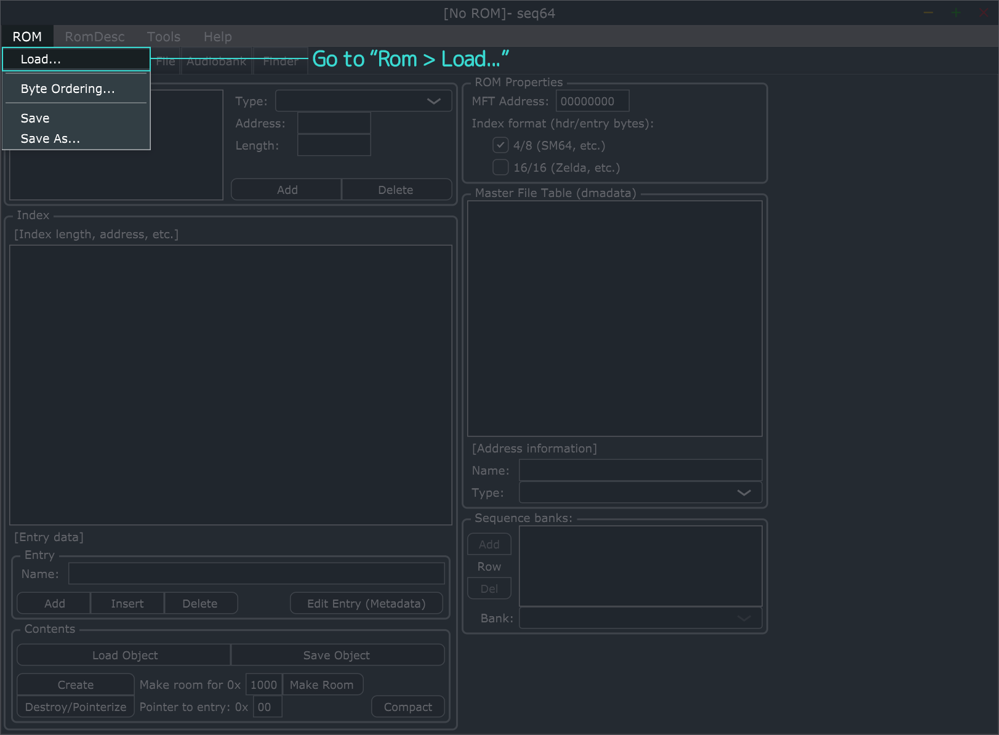
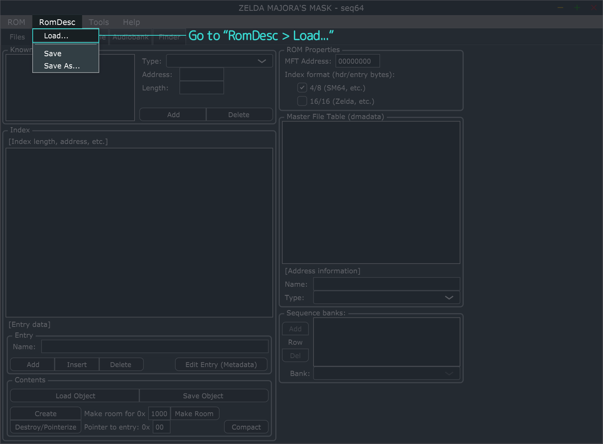
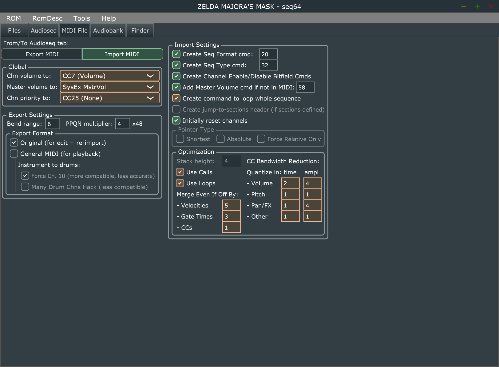

# Using SEQ64

-   :material-file-document-edit:{ .lg } __&nbsp;THIS PAGE IS A WIP__
  
    ---

    This page is a work in progress and requires further editing.

This page goes over how to get started with SEQ64 for creating custom music in *Ocarina of Time* and *Majora's Mask*. It will give a basic rundown on the program as well as importing and converting a `.mid` file into a sequence file.

!!! warning "Bugs and Errors"
    Please be aware that SEQ64 is an old program with many bugs, some known and others unknown. You may encounter errors and issues when using the program when editing a ROM, ROM description, sequence file, or audiobank file.

!!! info
    This page will be using SEQ64 `v1.5.0` and SEQ64 `v2.3.3` for images, SEQ64 `v1.0.0` should have no dfference from `v1.5.0` other than the UI style and theme of the program. Everything should be located in the same place and have all the same options for SEQ64 versions 1.0 and 1.5.

## Loading a ROM and ROM Description <small>v1.0.0 and v1.5.0 only</small> { #loading-a-rom-and-rom-description data-toc-label="Loading a ROM and ROM Description" }
When you first open SEQ64 you will see that everything is blank and none of the program's fields are populated with information. To begin working you will need to load your ROM into SEQ64 and load a ROM description for it. The images below highlight how to load a ROM and ROM Description. It should not matter what order you load your ROM or ROM description in, however it may be safest to load the ROM description first.

=== "Loading a  ROM"
    { .on-glb }

    To load your ROM into SEQ64 simply click the "ROM" button, then click the "Load..." option from the context menu that appears.

=== "Loading a ROM Description"
    { .on-glb }

    To load your ROM description into SEQ64 simply click the "RomDesc" button, then click the "Load..." option from the context menu that appears.

!!! info
    If your ROM has byte ordering other than Big Endian then the ROM's internal title shown in the title bar of SEQ64 will be switched around. You can change the byte ordering SEQ64 uses, however your ROM should be Big Endian byte ordering otherwise data may end up misaligned.

After loading your ROM and ROM description all of the program's fields should be populated with ROM information and all the information inside of the ROM description. If you loaded the ROM description first then fields will be populated, however not all of the fields will be until you also load your ROM.

## Importing a MIDI File Into SEQ64
placeholder

=== "SEQ64 v1.0.0 and v1.5.0"
    { .on-glb }

    Press the "Import MIDI" button to import a `.mid` file to convert into a sequence. Before importing you can change the highlighted values

    Fields highlighted in  orange are fields that are optional fields that can change how your sequence looks when imported.
    
    Fields highlighted in  green are fields that should not be changed, and instead be left as is.

=== "SEQ64 v2.X.X"
    

    Press the "Import MIDI" button to import a `.mid` file to convert into a sequence. Before importing you can change the highlighted values

    Fields highlighted in  orange are fields that are optional fields that can change how your sequence looks when imported.
    
    Fields highlighted in  green are fields that should not be changed, and instead be left as is.

-----