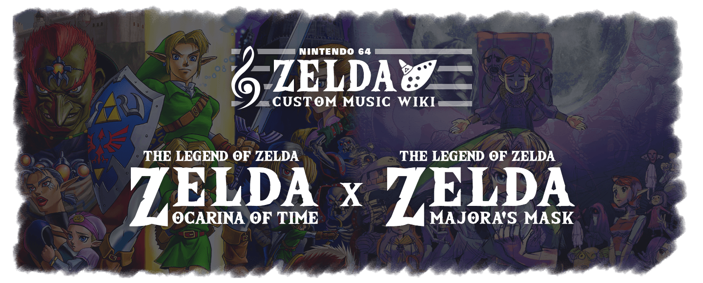

<!-- Remove unwanted elements -->

<!-- Splash Image -->
<figure markdown="span">
  { width="1400" height="580" }
  </figcaption>
</figure>

## Need Help? Join One of the Discord Servers Below

<!-- Create Discord Server Grid Buttons -->

-   :fontawesome-brands-discord:{ .lg .middle } __&nbsp;MMR Discord__
  
    ---

    For extra help with MMR related music issues join the Majora's Mask Randomzier Discord Server

    <a href="https://discord.gg/7jBRhhJ" target="_blank"><b>:material-open-in-new: Click Here to Join</b></a>

-   :fontawesome-brands-discord:{ .lg .middle } __&nbsp;Darunia's Joy Discord__

    ---

    For extra help with OOTR related music issues join the Darunia's Joy Discord Server

    <a href="https://discord.gg/EVpd499gkS" target="_blank"><b>:material-open-in-new: Click Here to Join</b></a>

-   :fontawesome-brands-discord:{ .lg .middle } __&nbsp;OOTMM Discord__

    ---

    For extra help with OOTMM music related issues join the Ocarina of Time & Majora's Mask Combo Randomizer Discord Server

    <a href="https://discord.gg/4QdtPBP6wf" target="_blank"><b>:material-open-in-new: Click Here to Join</b></a>

<!-- Begin the rest of the page -->