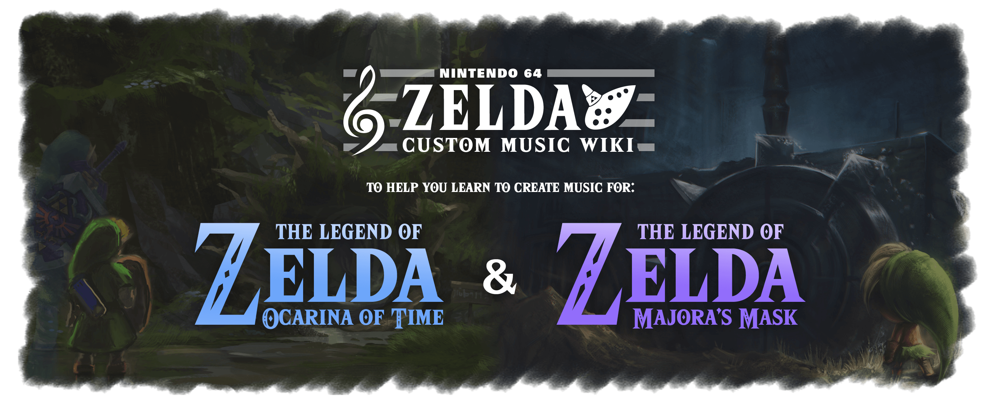

<!-- Remove unwanted elements -->

<!-- Splash Image -->
<figure markdown="span">
  { width="1260" height="580" }
  </figcaption>
</figure>

<!-- Create Discord Server Grid Buttons -->

-   :fontawesome-brands-discord:{ .lg .middle } __&nbsp;MMR Discord__
  
    ---

    For extra help with MMR related issues you can join the MMR Discord

    [:material-link-variant: Click Here to Join](https://discord.gg/7jBRhhJ)

-   :fontawesome-brands-discord:{ .lg .middle } __&nbsp;Darunia's Joy Discord__

    ---

    For extra help with OOTR related issues you can join the Darunia's Joy Discord

    [:material-link-variant: Click Here to Join](https://discord.gg/EVpd499gkS)

-   :fontawesome-brands-discord:{ .lg .middle } __&nbsp;OOTMM Discord__

    ---

    For extra help with combo randomizer related issues you can join the OOTMM Discord

    [:material-link-variant: Click Here to Join](https://discord.gg/4QdtPBP6wf)

<!-- Begin the rest of the page -->